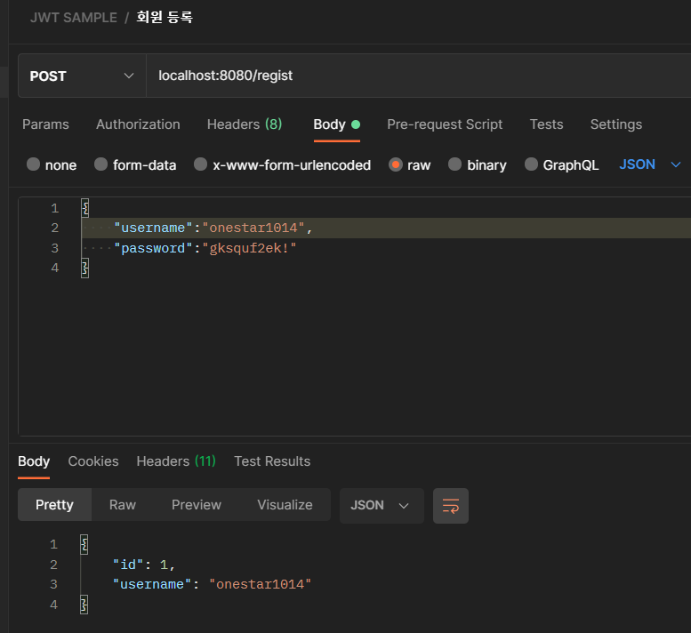
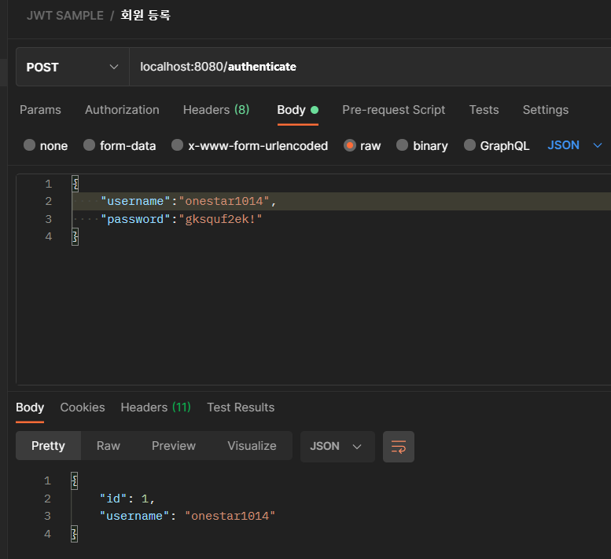
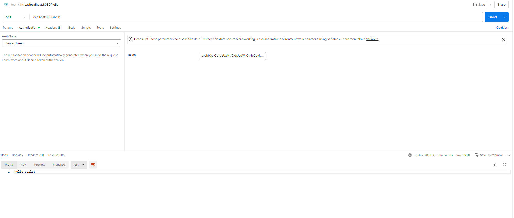

## Make DB for user info
```
docker run -d --name docker-mysql -e MYSQL_ROOT_PASSWORD=password -p 3306:3306 mysql:latest --character-set-server=utf8mb4 --collation-server=utf8mb4_unicode_ci
```

## Register USER
```
localhost:8080/regist
```


## Authenticate USER
```
localhost:8080/authenticate
```

## TEST
```
localhost:8080/hello
```
### Unauthorized User


### Authorized User
